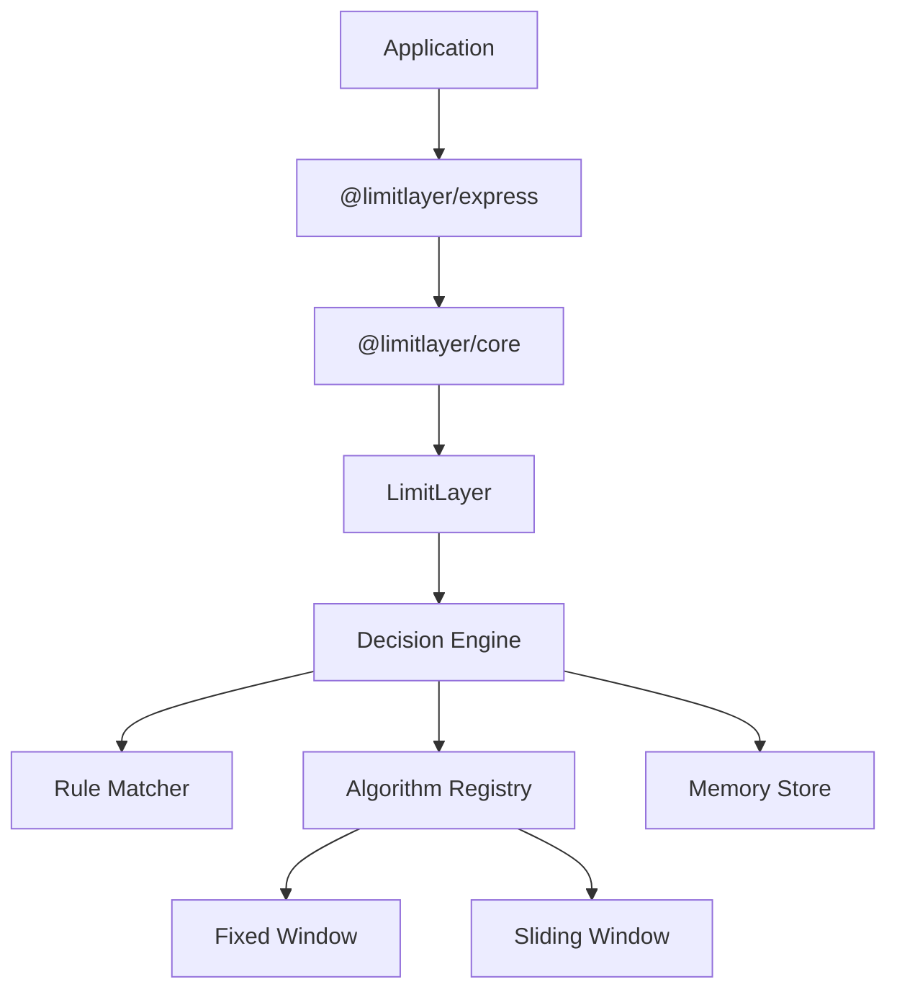

# 🚀 LimitLayer

> A modern, framework-agnostic rate limiting toolkit for Node.js and TypeScript.

[](https://github.com/gargavi-oss/limit-layer/actions/workflows/ci.yml)
[](https://www.npmjs.com/package/@limitlayer/core)
[](https://www.npmjs.com/package/@limitlayer/core)
[](LICENSE)


LimitLayer is an extensible rate-limiting toolkit designed for modern backend applications. It separates the core rate-limiting engine from framework adapters, allowing you to apply different algorithms to different endpoints while keeping a consistent developer experience.

Whether you're protecting authentication endpoints, public APIs, payment services, or webhooks, LimitLayer lets you choose the most appropriate strategy for each route.

---

# ✨ Features

* 🚀 Framework-agnostic core
* ⚡ High-performance TypeScript implementation
* 🧩 Modular architecture
* 🎯 Per-route algorithm selection
* ✅ Fixed Window algorithm
* ✅ Sliding Window algorithm
* 💾 Pluggable storage architecture
* 🧠 Extensible algorithm registry
* 📦 ESM + CommonJS support
* 🛠 Fully typed public API
* 🚀 Official Express adapter
* 📖 Simple, declarative configuration

---

# 🏗️ Architecture



---

# 📦 Packages

| Package               | Description                             |
| --------------------- | --------------------------------------- |
| `@limitlayer/core`    | Framework-agnostic rate limiting engine |
| `@limitlayer/express` | Official Express middleware             |

More adapters will be added in future releases.

---

# 🚀 Installation

### Core

```bash
npm install @limitlayer/core
```

### Express

```bash
npm install express @limitlayer/core @limitlayer/express
```

---

# ⚡ Quick Start

```ts
import {
  MemoryStore,
  createLimitLayer,
} from "@limitlayer/core";

const limiter = createLimitLayer({
  storage: new MemoryStore(),
  rules: [
    {
      path: "/login",
      algorithm: "sliding-window",
      limit: 5,
      window: "1m",
    },
    {
      path: "/api/*",
      algorithm: "fixed-window",
      limit: 100,
      window: "1m",
    },
  ],
});

const result = await limiter.consume({
  method: "POST",
  path: "/login",
  ip: "127.0.0.1",
  headers: {},
  query: {},
});

console.log(result);
```

---

# 🌐 Express Example

```ts
import express from "express";

import { MemoryStore } from "@limitlayer/core";
import { limitLayer } from "@limitlayer/express";

const app = express();

app.use(
  limitLayer({
    storage: new MemoryStore(),
    rules: [
      {
        path: "/login",
        algorithm: "sliding-window",
        limit: 5,
        window: "1m",
      },
      {
        path: "/api/*",
        algorithm: "fixed-window",
        limit: 100,
        window: "1m",
      },
    ],
  })
);

app.listen(3000);
```

---

# 🎯 Why LimitLayer?

Different endpoints often require different rate-limiting strategies.

```ts
rules: [
  {
    path: "/login",
    algorithm: "sliding-window",
    limit: 5,
    window: "1m",
  },
  {
    path: "/payments",
    algorithm: "fixed-window",
    limit: 20,
    window: "1m",
  },
  {
    path: "/api/*",
    algorithm: "fixed-window",
    limit: 100,
    window: "1m",
  },
]
```

Instead of using a single strategy everywhere, LimitLayer lets you configure each endpoint independently while using the same engine.

---

# 🧠 Built-in Algorithms

| Algorithm        | Status    |
| ---------------- | --------- |
| ✅ Fixed Window   | Available |
| ✅ Sliding Window | Available |
| 🚧 Token Bucket  | Planned   |
| 🚧 Sliding Log   | Planned   |
| 🚧 Leaky Bucket  | Planned   |

---

# 💾 Storage Adapters

| Storage          | Status    |
| ---------------- | --------- |
| ✅ MemoryStore    | Available |
| 🚧 RedisStore    | Planned   |
| 🚧 Upstash Redis | Planned   |
| 🚧 PostgreSQL    | Planned   |
| 🚧 MongoDB       | Planned   |

---

# 🛣️ Roadmap

### v0.1

* ✅ Core engine
* ✅ MemoryStore
* ✅ Fixed Window
* ✅ Sliding Window
* ✅ Express adapter
* ✅ TypeScript support
* ✅ GitHub Actions
* ✅ Unit tests

### Upcoming

* Token Bucket
* Sliding Log
* Leaky Bucket
* Redis storage adapter
* Additional storage adapters
* Performance benchmarking

### Future

* Fastify adapter
* Hono adapter
* Koa adapter
* NestJS integration
* Next.js integration
* Analytics dashboard
* Hosted SaaS platform

---

# 🛠️ Development

Clone the repository:

```bash
git clone https://github.com/gargavi-oss/limit-layer.git
cd limit-layer
pnpm install
```

Build all packages:

```bash
pnpm build
```

Run tests:

```bash
pnpm test
```

---

# 🤝 Contributing

Contributions are always welcome.

If you'd like to improve LimitLayer:

1. Fork the repository.
2. Create a feature branch.
3. Make your changes.
4. Add or update tests where appropriate.
5. Submit a Pull Request.

Feature ideas, bug reports, and discussions are also appreciated.

---

# 📄 License

MIT License.

---

Built with ❤️ in TypeScript.
